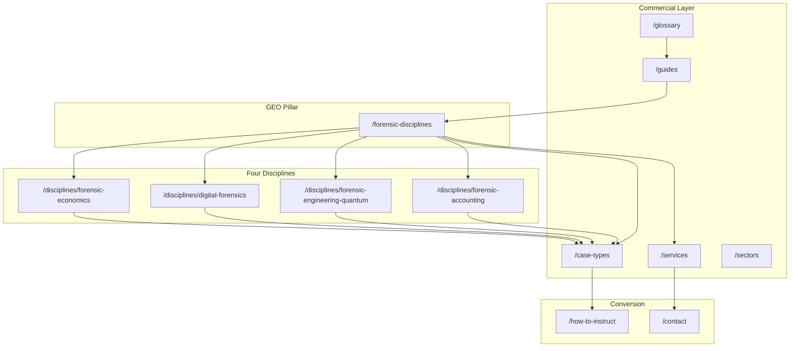
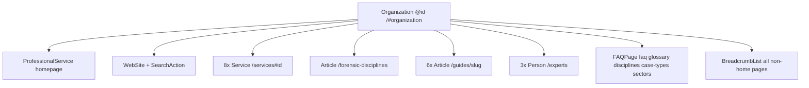

# SEO Architecture — disputeforensic.com

**Site:** https://www.disputeforensic.com  
**Audience:** UK solicitors, litigation counsel, and in-house legal teams instructing forensic expert witnesses  
**Primary KPI:** Rank for Tier 1 transactional terms (e.g. *forensic expert witness UK*, *dispute forensic expert witness*, discipline-specific expert witness terms)  
**Last updated:** May 2026

This document is the canonical SEO blueprint for DisputeForensic.com. It governs keyword targeting, content clusters, internal linking, structured data, GEO (generative engine optimization), off-page activity, competitor monitoring, multi-discipline positioning, and deployment.

**Unique differentiator:** This is the only site in the expert-witness network covering **all four forensic disciplines** under one domain. See [Section 8](#8-strategic-positioning-note).

---

## Table of contents

1. [Keyword strategy](#1-keyword-strategy)
2. [Content cluster map](#2-content-cluster-map)
3. [Internal linking rules](#3-internal-linking-rules)
4. [Schema architecture](#4-schema-architecture)
5. [GEO optimization targets](#5-geo-optimization-targets)
6. [Off-page SEO targets](#6-off-page-seo-targets)
7. [Competitor monitoring](#7-competitor-monitoring)
8. [Strategic positioning note](#8-strategic-positioning-note)
9. [Deployment checklist](#9-deployment-checklist)
- [Sitemap & robots generation](#sitemap--robots-generation)
- [Appendix A: Full route inventory](#appendix-a-full-route-inventory)
- [Appendix B: Sitemap priorities](#appendix-b-sitemap-priorities)
- [Appendix C: Title and meta templates](#appendix-c-title-and-meta-templates)
- [Appendix D: Implementation status](#appendix-d-implementation-status)

---

## 1. Keyword strategy

### Tier 1 — Transactional

| Keyword |
|---------|
| dispute forensic expert witness |
| forensic expert witness UK |
| forensic expert witness disputes UK |
| forensic accounting expert witness UK |
| forensic engineering expert witness UK |
| digital forensics expert witness UK |
| forensic economics expert witness UK |
| dispute forensic consultant UK |
| forensic expert witness litigation UK |
| forensic expert witness arbitration UK |

### Tier 2 — Informational

| Keyword |
|---------|
| what is a forensic expert witness |
| forensic expert witness disciplines UK |
| difference forensic accounting forensic economics |
| when do you need digital forensics expert witness |
| forensic engineering expert construction disputes UK |
| what is hot-tubbing expert witnesses |
| IBA rules evidence forensic experts |
| CPR Part 35 forensic expert UK |
| forensic expert witness fees UK |
| multi-discipline forensic expert team |

### Tier 3 — Long-tail / discipline

| Keyword |
|---------|
| construction quantum forensic expert witness UK |
| competition law forensic economist UK |
| IP theft digital forensics expert witness |
| cartel damages forensic economist UK |
| cybercrime forensic expert witness civil claim |
| ICSID investment treaty forensic expert witness |
| forensic accounting fraud investigation expert UK |
| digital forensics e-discovery expert UK |
| concurrent evidence hot-tubbing forensic expert |
| forensic expert witness international arbitration |

### Keyword → URL mapping

| Keyword cluster | Primary URL | Secondary URLs |
|-----------------|-------------|----------------|
| forensic expert witness UK | `/forensic-disciplines` | `/`, `/what-is-forensic-expert-witness`, `/disciplines` |
| dispute forensic expert witness | `/` | `/forensic-disciplines`, `/contact` |
| forensic accounting expert witness UK | `/disciplines/forensic-accounting` | `/guides/forensic-accounting-disputes-guide`, `/case-types/commercial-fraud-financial-crime` |
| forensic engineering expert witness UK | `/disciplines/forensic-engineering-quantum` | `/guides/construction-quantum-forensic-guide`, `/case-types/construction-engineering-disputes` |
| digital forensics expert witness UK | `/disciplines/digital-forensics` | `/guides/digital-forensics-evidence-guide`, `/case-types/cybercrime-data-disputes` |
| forensic economics expert witness UK | `/disciplines/forensic-economics` | `/guides/forensic-economics-competition-guide`, `/case-types/competition-law-cartel-damages` |
| forensic expert witness litigation UK | `/qualifications` | `/how-to-instruct`, `/glossary#cpr-part-35`, `/faq` |
| forensic expert witness arbitration UK | `/case-types/international-arbitration` | `/glossary#iba-rules-on-evidence`, `/disciplines/forensic-economics` |
| what is a forensic expert witness | `/what-is-forensic-expert-witness` | `/forensic-disciplines`, `/faq` |
| forensic expert witness disciplines UK | `/forensic-disciplines` | All `/disciplines/[slug]`, `/glossary` |
| difference forensic accounting forensic economics | `/forensic-disciplines` | `/disciplines/forensic-accounting`, `/disciplines/forensic-economics` |
| when do you need digital forensics expert witness | `/guides/digital-forensics-evidence-guide` | `/disciplines/digital-forensics`, `/case-types/cybercrime-data-disputes` |
| forensic engineering construction disputes UK | `/case-types/construction-engineering-disputes` | `/disciplines/forensic-engineering-quantum`, `/sectors/construction-infrastructure` |
| hot-tubbing / concurrent evidence | `/guides/hot-tubbing-concurrent-evidence-guide` | `/glossary#hot-tubbing`, `/glossary#concurrent-evidence-hot-tubbing` |
| IBA rules evidence forensic experts | `/case-types/international-arbitration` | `/glossary#iba-rules-on-evidence`, `/qualifications` |
| CPR Part 35 forensic expert UK | `/qualifications` | `/glossary#cpr-part-35`, `/how-to-instruct`, `/faq` |
| forensic expert witness fees UK | `/fees` | `/faq`, `/how-to-instruct` |
| multi-discipline forensic expert team | `/guides/multi-discipline-forensic-teams` | `/forensic-disciplines`, all `/disciplines/[slug]` |
| construction quantum forensic expert witness UK | `/guides/construction-quantum-forensic-guide` | `/disciplines/forensic-engineering-quantum`, `/services#construction-quantum-delay` |
| competition law forensic economist UK | `/case-types/competition-law-cartel-damages` | `/guides/forensic-economics-competition-guide`, `/disciplines/forensic-economics` |
| IP theft digital forensics expert witness | `/case-types/ip-theft-misappropriation` | `/disciplines/digital-forensics`, `/glossary#metadata-analysis` |
| cartel damages forensic economist UK | `/guides/forensic-economics-competition-guide` | `/case-types/competition-law-cartel-damages`, `/glossary#econometric-analysis` |
| cybercrime forensic expert witness civil claim | `/case-types/cybercrime-data-disputes` | `/disciplines/digital-forensics`, `/services#digital-forensics-ediscovery` |
| ICSID investment treaty forensic expert witness | `/case-types/international-arbitration` | `/disciplines/forensic-economics`, `/glossary#chorz-w-factory-standard` |
| forensic accounting fraud investigation expert UK | `/case-types/commercial-fraud-financial-crime` | `/services#fraud-investigation-asset-tracing`, `/guides/forensic-accounting-disputes-guide` |
| digital forensics e-discovery expert UK | `/services#digital-forensics-ediscovery` | `/guides/digital-forensics-evidence-guide`, `/glossary#cpr-part-31-e-discovery` |
| forensic expert witness international arbitration | `/case-types/international-arbitration` | `/disciplines/forensic-economics`, `/fees` (arbitration section) |

---

## 2. Content cluster map

Eight topical hubs anchor the site. The GEO pillar page `/forensic-disciplines` sits at the centre of discipline and methodology clusters.

### URL canonicalization policy

All internal links, sitemap entries, schema `@id` values, and JSON-LD must use **canonical slugs** below. Shorthand paths from early SEO briefs are **aliases only** — do not create duplicate routes.

| Alias (do not use as route) | Canonical path |
|-----------------------------|----------------|
| `/guides/forensic-accounting-disputes` | `/guides/forensic-accounting-disputes-guide` |
| `/guides/construction-quantum-forensic` | `/guides/construction-quantum-forensic-guide` |
| `/guides/digital-forensics-evidence` | `/guides/digital-forensics-evidence-guide` |
| `/guides/forensic-economics-competition` | `/guides/forensic-economics-competition-guide` |
| `/guides/hot-tubbing-concurrent-evidence` | `/guides/hot-tubbing-concurrent-evidence-guide` |
| `/guides/hot-tubbing` | `/guides/hot-tubbing-concurrent-evidence-guide` |
| `/case-types/commercial-fraud` | `/case-types/commercial-fraud-financial-crime` |
| `/case-types/construction-engineering` | `/case-types/construction-engineering-disputes` |
| `/case-types/competition-law-cartel` | `/case-types/competition-law-cartel-damages` |
| `/case-types/ip-theft` | `/case-types/ip-theft-misappropriation` |
| `/case-types/shareholder-commercial` | `/case-types/shareholder-commercial-disputes` |
| `/disciplines/forensic-engineering` | `/disciplines/forensic-engineering-quantum` |
| `/glossary#ediscovery` | `/glossary#e-discovery-electronic-disclosure` |
| `/glossary#tia` | `/glossary#time-impact-analysis-tia` |
| `/glossary#iba-rules` | `/glossary#iba-rules-on-evidence` |
| `/glossary#chorzow-factory` | `/glossary#chorz-w-factory-standard` |
| `/glossary#concurrent-evidence` | `/glossary#concurrent-evidence-hot-tubbing` |
| `/glossary#cpr-part-31` | `/glossary#cpr-part-31-e-discovery` |

### Hub overview

| Hub | Pillar / anchor | Primary intent |
|-----|-----------------|----------------|
| 1 | Forensic Accounting | Loss quantification, fraud, asset tracing, valuation |
| 2 | Forensic Engineering & Quantum | Construction quantum, delay, TCC disputes |
| 3 | Digital Forensics | E-discovery, cybercrime, IP theft, metadata |
| 4 | Forensic Economics | Competition damages, econometrics, investment treaty |
| 5 | Forensic Disciplines (Master) | Pillar taxonomy of all four disciplines |
| 6 | Hot-Tubbing & Procedure | Concurrent evidence, joint statements, instruction |
| 7 | Multi-Discipline Teams | Coordinated multi-expert instructions |
| 8 | International Arbitration | IBA Rules, ICSID, cross-border forensic evidence |

### Hub 1: Forensic Accounting

**Supporting pages:**

- `/disciplines/forensic-accounting`
- `/guides/forensic-accounting-disputes-guide`
- `/case-types/commercial-fraud-financial-crime`
- `/case-types/shareholder-commercial-disputes`
- `/case-types/professional-negligence`
- `/glossary#forensic-accounting`
- `/glossary#but-for-analysis`
- `/glossary#asset-tracing`
- `/services#forensic-loss-quantification`

### Hub 2: Forensic Engineering & Quantum

**Supporting pages:**

- `/disciplines/forensic-engineering-quantum`
- `/guides/construction-quantum-forensic-guide`
- `/case-types/construction-engineering-disputes`
- `/sectors/construction-infrastructure`
- `/glossary#forensic-engineering`
- `/glossary#quantum`
- `/glossary#scott-schedule`
- `/glossary#prolongation-construction`
- `/glossary#time-impact-analysis-tia`

### Hub 3: Digital Forensics

**Supporting pages:**

- `/disciplines/digital-forensics`
- `/guides/digital-forensics-evidence-guide`
- `/case-types/cybercrime-data-disputes`
- `/case-types/ip-theft-misappropriation`
- `/sectors/technology-software-digital`
- `/glossary#digital-forensics`
- `/glossary#metadata-analysis`
- `/glossary#chain-of-custody-digital`
- `/glossary#e-discovery-electronic-disclosure`
- `/glossary#cpr-part-31-e-discovery`

### Hub 4: Forensic Economics

**Supporting pages:**

- `/disciplines/forensic-economics`
- `/guides/forensic-economics-competition-guide`
- `/case-types/competition-law-cartel-damages`
- `/case-types/international-arbitration`
- `/sectors/energy-utilities`
- `/glossary#forensic-economics`
- `/glossary#econometric-analysis`
- `/glossary#chorz-w-factory-standard`

### Hub 5: Forensic Disciplines Master

**Supporting pages:**

- `/forensic-disciplines` (pillar)
- All `/disciplines/[slug]` (×4)
- `/what-is-forensic-expert-witness`
- `/glossary` (all terms)
- `/faq` (disciplines Q&As)

### Hub 6: Hot-Tubbing & Procedure

**Supporting pages:**

- `/guides/hot-tubbing-concurrent-evidence-guide`
- `/glossary#concurrent-evidence-hot-tubbing`
- `/glossary#hot-tubbing`
- `/glossary#joint-statement-experts`
- `/how-to-instruct` (hot-tubbing section)
- `/case-types/construction-engineering-disputes`
- `/case-types/international-arbitration`

### Hub 7: Multi-Discipline Teams

**Supporting pages:**

- `/guides/multi-discipline-forensic-teams`
- `/case-types/commercial-fraud-financial-crime` (multi-discipline)
- `/case-types/ip-theft-misappropriation`
- `/case-types/international-arbitration`
- `/sectors/energy-utilities`
- All `/disciplines/[slug]` (×4)

### Hub 8: International Arbitration

**Supporting pages:**

- `/case-types/international-arbitration`
- `/disciplines/forensic-economics`
- `/disciplines/forensic-engineering-quantum`
- `/guides/forensic-economics-competition-guide`
- `/glossary#iba-rules-on-evidence`
- `/glossary#chorz-w-factory-standard`
- `/fees` (arbitration section)

### Content cluster diagram



### Slug inventories

#### Disciplines (4)

| Slug | H1 focus |
|------|----------|
| `forensic-accounting` | Forensic Accounting Expert Witness Services UK |
| `forensic-engineering-quantum` | Forensic Engineering & Quantum Expert Witness Services UK |
| `digital-forensics` | Digital Forensics Expert Witness Services UK |
| `forensic-economics` | Forensic Economics Expert Witness Services UK |

*Source: `src/data/disciplines.ts`*

#### Case types (10)

| Slug | H1 focus |
|------|----------|
| `commercial-fraud-financial-crime` | Commercial Fraud & Financial Crime Forensic Expert Witness UK |
| `construction-engineering-disputes` | Construction & Engineering Disputes Forensic Expert Witness UK |
| `cybercrime-data-disputes` | Cybercrime & Data Disputes Forensic Expert Witness UK |
| `competition-law-cartel-damages` | Competition Law & Cartel Damages Forensic Expert Witness UK |
| `ip-theft-misappropriation` | IP Theft & Misappropriation Forensic Expert Witness UK |
| `shareholder-commercial-disputes` | Shareholder & Commercial Disputes Forensic Expert Witness UK |
| `professional-negligence` | Professional Negligence Forensic Expert Witness UK |
| `international-arbitration` | International Arbitration Forensic Expert Witness UK |
| `matrimonial-financial-disputes` | Matrimonial Financial Disputes Forensic Expert Witness UK |
| `regulatory-investigations` | Regulatory Investigations Forensic Expert Witness UK |

*Source: `src/data/case-types.ts`*

#### Guides (6)

| Slug | `aboutServiceId` (Article schema) |
|------|-----------------------------------|
| `forensic-accounting-disputes-guide` | `forensic-loss-quantification` |
| `construction-quantum-forensic-guide` | `construction-quantum-delay` |
| `digital-forensics-evidence-guide` | `digital-forensics-ediscovery` |
| `forensic-economics-competition-guide` | `economic-damages-analysis` |
| `hot-tubbing-concurrent-evidence-guide` | `expert-determination-adr` |
| `multi-discipline-forensic-teams` | `forensic-loss-quantification` |

*Source: `src/data/guides.ts`*

#### Sectors (6)

| Slug | H1 focus |
|------|----------|
| `construction-infrastructure` | Construction & Infrastructure Forensic Expert Witness UK |
| `financial-services-banking` | Financial Services & Banking Forensic Expert Witness UK |
| `technology-software-digital` | Technology & Software Forensic Expert Witness UK |
| `energy-utilities` | Energy & Utilities Forensic Expert Witness UK |
| `professional-services` | Professional Services Forensic Expert Witness UK |
| `life-sciences-healthcare` | Life Sciences & Healthcare Forensic Expert Witness UK |

*Source: `src/data/sectors.ts`*

#### Services (8 anchors on `/services`)

| Anchor ID | Label |
|-----------|-------|
| `forensic-loss-quantification` | Forensic Loss Quantification |
| `fraud-investigation-asset-tracing` | Fraud Investigation & Asset Tracing |
| `construction-quantum-delay` | Construction Quantum & Delay Analysis |
| `digital-forensics-ediscovery` | Digital Forensics & E-Discovery |
| `economic-damages-analysis` | Economic Damages Analysis |
| `business-share-valuation` | Business & Share Valuation |
| `regulatory-investigation-support` | Regulatory Investigation Support |
| `expert-determination-adr` | Expert Determination & ADR |

*Source: `src/data/services.ts`, `src/lib/schema.ts` (`serviceNode` IDs)*

#### Glossary (35 terms, definition-first)

Anchor slugs generated by `glossaryAnchorId()` in `src/lib/glossary-slug.ts`.

| # | Term | Anchor slug |
|---|------|-------------|
| 1 | Account of Profits | `#account-of-profits` |
| 2 | Asset Tracing | `#asset-tracing` |
| 3 | But-For Analysis | `#but-for-analysis` |
| 4 | CEng (Chartered Engineer) | `#ceng-chartered-engineer` |
| 5 | Chain of Custody (Digital) | `#chain-of-custody-digital` |
| 6 | Chorzów Factory Standard | `#chorz-w-factory-standard` |
| 7 | Concurrent Evidence (Hot-Tubbing) | `#concurrent-evidence-hot-tubbing` |
| 8 | CPR Part 31 (E-Discovery) | `#cpr-part-31-e-discovery` |
| 9 | CPR Part 35 | `#cpr-part-35` |
| 10 | Daubert Standard (US equivalent) | `#daubert-standard-us-equivalent` |
| 11 | Delay Analysis (Construction) | `#delay-analysis-construction` |
| 12 | Digital Forensics | `#digital-forensics` |
| 13 | E-Discovery (Electronic Disclosure) | `#e-discovery-electronic-disclosure` |
| 14 | Econometric Analysis | `#econometric-analysis` |
| 15 | EnCE (EnCase Certified Examiner) | `#ence-encase-certified-examiner` |
| 16 | Expert Determination | `#expert-determination` |
| 17 | FBCS (Fellow — British Computer Society) | `#fbcs-fellow-british-computer-society` |
| 18 | Forensic Accounting | `#forensic-accounting` |
| 19 | Forensic Economics | `#forensic-economics` |
| 20 | Forensic Engineering | `#forensic-engineering` |
| 21 | GCFE (GIAC Certified Forensic Examiner) | `#gcfe-giac-certified-forensic-examiner` |
| 22 | Hot-Tubbing | `#hot-tubbing` |
| 23 | IBA Rules on Evidence | `#iba-rules-on-evidence` |
| 24 | The Ikarian Reefer Duties | `#the-ikarian-reefer-duties` |
| 25 | Joint Statement (Experts) | `#joint-statement-experts` |
| 26 | Loss and Expense (Construction) | `#loss-and-expense-construction` |
| 27 | Metadata Analysis | `#metadata-analysis` |
| 28 | Norwich Pharmacal Order | `#norwich-pharmacal-order` |
| 29 | Party-Appointed Expert (PAE) | `#party-appointed-expert-pae` |
| 30 | Prolongation (Construction) | `#prolongation-construction` |
| 31 | Quantum | `#quantum` |
| 32 | SAAMCo Principle | `#saamco-principle` |
| 33 | Scott Schedule | `#scott-schedule` |
| 34 | Single Joint Expert (SJE) | `#single-joint-expert-sje` |
| 35 | Time Impact Analysis (TIA) | `#time-impact-analysis-tia` |

*Source: `src/data/glossary.ts`*

---

## 3. Internal linking rules

These rules govern all on-page and component-level links. Implement via `relatedLinks` in data files, `RelatedLinks` component, nav/footer in `src/data/nav.ts`, and merge helpers in `src/lib/seo-internal-links.ts` (to be created during site build).

### Rule 1 — `/forensic-disciplines` links to:

- All 4 `/disciplines/[slug]` pages
- All relevant `/case-types/[slug]` pages (via combination table)
- All relevant `/glossary` terms (discipline definitions)
- `/guides` hub
- `/contact`

### Rule 2 — Every `/disciplines/[slug]` links to:

- `/forensic-disciplines` (pillar)
- Relevant `/case-types/[slug]` (at least 3)
- Relevant `/sectors/[slug]`
- Relevant `/guides/[slug]`
- `/qualifications` (discipline section)
- `/contact`

**Current baseline** (`STANDARD_RELATED_LINKS` in `src/data/disciplines.ts`): `/services`, `/case-types`, `/guides`, `/contact`. Expand per discipline during page implementation.

### Rule 3 — Every `/case-types/[slug]` links to:

- Relevant `/disciplines/[slug]`
- Relevant `/services` section (anchor ID)
- Relevant `/guides/[slug]`
- `/forensic-disciplines`
- `/glossary` (key terms)
- `/how-to-instruct`
- `/contact`

*Partially implemented in `src/data/case-types.ts` `relatedLinks`.*

### Rule 4 — Every `/guides/[slug]` links to:

- `/guides` hub
- Relevant `/disciplines/[slug]`
- Relevant `/case-types/[slug]`
- `/forensic-disciplines`
- `/how-to-instruct`
- `/qualifications`
- `/contact`

*Partially implemented in `src/data/guides.ts` `relatedLinks`.*

### Rule 5 — `/glossary` terms link to:

- Most relevant `/disciplines/[slug]`
- Most relevant `/case-types/[slug]`
- `/forensic-disciplines` for discipline-definition terms
- `/guides/[slug]` for methodology terms

*Many terms already have `href` in `src/data/glossary.ts`.*

### Rule 6 — Homepage links to:

- All 4 `/disciplines/[slug]`
- `/forensic-disciplines`
- All 8 `/services` (section anchors)
- `/case-types` hub
- `/what-is-forensic-expert-witness`
- `/guides` hub
- `/faq`
- `/contact`

*Implement in homepage component and mirror in `src/data/nav.ts` footer columns.*

### Internal linking implementation map

| Component / file | Role |
|------------------|------|
| `src/data/nav.ts` | Global nav, mobile groups, footer columns |
| `src/data/*/relatedLinks` | Per-page related link sets |
| `src/components/RelatedLinks.tsx` | Renders related link grid at page bottom |
| `src/components/ContentPageTemplate.tsx` | Breadcrumb + FAQ JSON-LD + related links |
| `src/components/GuidePageTemplate.tsx` | Article schema + related links |
| `src/components/CTASection.tsx` | Hard-coded `/contact` CTA |
| `src/lib/seo-internal-links.ts` | Merge helpers (pending) |

---

## 4. Schema architecture

### Root graph

Root entity: **Organization**  
`@id`: `https://www.disputeforensic.com/#organization`



### Children of Organization

| Schema type | Page(s) | Builder |
|-------------|---------|---------|
| Organization | Root `@graph` | `organizationSchema` in `src/lib/schema.ts` |
| ProfessionalService | Homepage | `professionalServiceSchema()` |
| WebSite + SearchAction | Homepage | `websiteSchema` — targets `/glossary?q={search_term_string}` |
| Service (×8) | `/services#…` | `serviceNode()` |
| Article | `/forensic-disciplines` (pillar) | `articleSchema()` |
| Article (×6) | `/guides/[slug]` | `articleSchema()` with optional `aboutServiceId` |
| Person (×3) | `/experts` | `personSchema()` |
| FAQPage | `/faq`, `/glossary`, `/disciplines/[slug]` (×4), `/case-types/[slug]` (×10), `/sectors/[slug]` (×6) | `faqPageSchema()` |
| BreadcrumbList | All non-homepage pages | `breadcrumbSchema()` |

### Per-page schema assignment

| Page type | Schema types | Source |
|-----------|-------------|--------|
| Homepage | Organization, ProfessionalService, WebSite + SearchAction | `layout.tsx` + `page.tsx` |
| `/forensic-disciplines` | Article | `articleSchema()` |
| `/guides/[slug]` | Article + BreadcrumbList | `GuidePageTemplate.tsx` |
| `/disciplines/[slug]`, `/case-types/[slug]`, `/sectors/[slug]` | FAQPage + BreadcrumbList | `ContentPageTemplate.tsx` |
| `/services` | 8× Service nodes | `serviceNode()` |
| `/experts` | 3× Person | `personSchema()` |
| `/glossary`, `/faq` | FAQPage | `faqPageSchema()` |

### Homepage `@graph` example

Inject in root layout or homepage via `JsonLd` component (`src/components/JsonLd.tsx`):

```json
{
  "@context": "https://schema.org",
  "@graph": [
    { "@type": "Organization", "@id": "https://www.disputeforensic.com/#organization", "..." : "..." },
    { "@type": "ProfessionalService", "@id": "https://www.disputeforensic.com/#service", "provider": { "@id": "https://www.disputeforensic.com/#organization" } },
    { "@type": "WebSite", "@id": "https://www.disputeforensic.com/#website", "publisher": { "@id": "https://www.disputeforensic.com/#organization" }, "potentialAction": { "@type": "SearchAction", "target": "https://www.disputeforensic.com/glossary?q={search_term_string}" } }
  ]
}
```

---

## 5. GEO optimization targets

AI citation content — structured, definition-first, table-heavy pages designed for retrieval by generative search engines.

| # | Target | URL | Content format | Primary keywords |
|---|--------|-----|----------------|------------------|
| 1 | Four forensic disciplines master table | `/forensic-disciplines` | Comparison table (discipline, expertise, disputes, credentials) | forensic expert witness disciplines UK |
| 2 | When multiple disciplines are needed table | `/forensic-disciplines` | Dispute-type → disciplines matrix | multi-discipline forensic expert team |
| 3 | Hot-tubbing explained | `/guides/hot-tubbing-concurrent-evidence-guide` + `/glossary#hot-tubbing` | Procedural guide + definition | what is hot-tubbing expert witnesses |
| 4 | Digital forensics methodology | `/guides/digital-forensics-evidence-guide` | Phase-by-phase methodology | digital forensics expert witness UK |
| 5 | Construction forensic disciplines comparison | `/disciplines/forensic-engineering-quantum` | Quantum vs delay vs engineering comparison | forensic engineering construction disputes UK |
| 6 | Competition damages methodology | `/guides/forensic-economics-competition-guide` | Econometric methodology, pass-on | cartel damages forensic economist UK |
| 7 | IBA Rules on Evidence summary | `/case-types/international-arbitration` | Articles 5–6 expert evidence summary | IBA rules evidence forensic experts |
| 8 | Fees by discipline table | `/fees` | Rate ranges by discipline and forum | forensic expert witness fees UK |
| 9 | Glossary (35 terms) | `/glossary` | Definition-first, one paragraph per term | CPR Part 35, quantum, hot-tubbing, etc. |
| 10 | Instruction flowchart | `/how-to-instruct` | Step 1: discipline identification flowchart | how to instruct forensic expert witness |

### Unique GEO assets

1. **Four forensic disciplines master table** — no competitor covers all four disciplines on one pillar page.
2. **Hot-tubbing guide** — no major competitor has a dedicated hot-tubbing guide page; high-value uncontested long-tail.

---

## 6. Off-page SEO targets

### Directories

| Directory | URL | Priority |
|-----------|-----|----------|
| UK Register of Expert Witnesses | jspubs.com | Primary — filter by forensic disciplines |
| Academy of Experts | academyofexperts.org | Credential-aligned listing |
| Expert Witness Institute (EWI) | ewi.org.uk | Core expert witness directory |
| ICAEW Forensic accreditation | icaew.com | Forensic accounting discipline |
| ACFE UK Chapter directory | acfe.com | Fraud / forensic accounting |
| RICS Expert Witness Register | rics.org | Forensic engineering / quantum |
| BCS expert directory | bcs.org | Digital forensics discipline |

### Publications (guest articles, citations, commentary)

| Publication | Relevance |
|-------------|-----------|
| Construction Law Journal | Forensic engineering, quantum, TCC |
| Digital Investigation (Elsevier) | Digital forensics methodology |
| Competition Law Journal | Forensic economics, cartel damages |
| Arbitration International (LCIA) | International arbitration experts |
| Global Arbitration Review (GAR) | Cross-border forensic evidence |
| ICAEW economia | Forensic accounting |
| Lexology | Practitioner-facing commentary |

### Digital PR angles

| Angle | Target keywords / audience |
|-------|---------------------------|
| "Hot-Tubbing in UK Courts: When Forensic Experts Give Evidence Together" | hot-tubbing, concurrent evidence, TCC |
| "Multi-Discipline Forensic Teams: How HKA, Kroll, and FTI Approach Complex Disputes" | multi-discipline forensic expert team |
| "Digital Forensics in Civil Disputes: What Solicitors Need to Know 2025" | digital forensics expert witness UK |
| "Forensic Economics in 2025: Competition Damages and Investment Treaty Claims" | forensic economics, ICSID |
| "The Four Forensic Disciplines: A Complete Guide for UK Litigation Counsel" | forensic expert witness disciplines UK |

---

## 7. Competitor monitoring

### Monthly review targets

| Competitor | URL | What to track |
|------------|-----|---------------|
| HKA | hka.com/services/ | Discipline pages, construction quantum content |
| Kroll | kroll.com/en/services/expert-services | Multi-discipline positioning, case studies |
| Grant Thornton | grantthornton.co.uk/services/forensic-and-investigation-services | Forensic accounting, fraud content |
| EY | ey.com/en_uk/services/assurance/forensic-claims-disputes | Claims disputes, expert witness signals |
| BDO | bdo.co.uk/en-gb/services/advisory/forensic-accounting-services/forensic-expert-witness | Expert witness pages, fee signals |
| UK Register (jspubs) | jspubs.com/expert-witness/si/f/forensic | New forensic expert listings |

### Track signals

- New discipline or service pages
- New case type coverage
- Chambers / Legal 500 ranking changes
- Fee rate signals on competitor sites
- New guide or thought-leadership content
- Hot-tubbing or concurrent evidence content (DisputeForensic first-mover advantage)

---

## 8. Strategic positioning note

disputeforensic.com is the **only site in the network covering all four forensic disciplines under one domain**.

This creates keyword coverage that no single-discipline site can match:

- "forensic accounting expert witness"
- "forensic engineering expert witness"
- "digital forensics expert witness"
- "forensic economics expert witness"

Plus the umbrella terms:

- "forensic expert witness UK"
- "dispute forensic expert"

Document this multi-discipline positioning as the core strategic advantage in all SEO planning — page titles, meta descriptions, H1s, internal anchor text, and schema `serviceType` should reinforce cross-discipline coverage.

### Hot-tubbing first-mover advantage

The site uniquely covers **hot-tubbing** (concurrent evidence) with a dedicated guide page at `/guides/hot-tubbing-concurrent-evidence-guide`. This is an increasingly common procedure in TCC, CAT, and international arbitration that no major competitor has addressed with standalone content. Target long-tail queries: *what is hot-tubbing expert witnesses*, *concurrent evidence hot-tubbing forensic expert*.

### Multi-discipline coordination

Complex disputes (construction fraud, IP theft with financial loss, investment treaty claims) require coordinated teams across disciplines. DisputeForensic.com is positioned as the single portal for instructing and coordinating multi-discipline forensic expert teams — a capability competitors address only within their own discipline silo.

---

## 9. Deployment checklist

| Item | Status | Location / notes |
|------|--------|------------------|
| Vercel deployment | Pending | No `vercel.json` yet |
| DNS: disputeforensic.com → www | **Done** | `middleware.ts` — 301 apex redirect |
| hreflang: en-GB, en-US, x-default | Partial | `src/lib/metadata.ts` — en-GB + x-default; en-US deferred until US-localized content |
| `html lang="en-GB"` | **Done** | `src/app/layout.tsx` |
| `NEXT_PUBLIC_FORMSPREE_FORM_ID` | Ready | `.env.example` |
| `NEXT_PUBLIC_SITE_URL` | Ready | `src/lib/site.ts` — `https://www.disputeforensic.com` |
| `GOOGLE_SITE_VERIFICATION` | Ready | Wired in `createMetadata()` |
| `BING_SITE_VERIFICATION` | Ready | Wired in `createMetadata()` via `msvalidate.01` |
| `NEXT_PUBLIC_GA_MEASUREMENT_ID` | Ready (env only) | No analytics loader yet |
| LinkedIn: DisputeForensic company page | Off-site action | `LINKEDIN_URL` in `src/lib/site.ts` |
| Submit to jspubs, Academy, EWI, ICAEW, RICS, BCS | Off-site action | See Section 6 directories |

### Pre-launch SEO verification

```bash
npm run seo:generate   # Regenerate sitemap.xml + robots.txt
npm run seo:verify     # Fail if sitemap drifts from inventory
npm run build          # Runs seo:generate before next build
```

---

## Sitemap & robots generation

Both files are **generated by a Node script** (not hand-edited) so the URL list stays aligned with the app.

| Output | Path | Generator |
|--------|------|-----------|
| XML sitemap | `public/sitemap.xml` | `scripts/generate-seo.ts` |
| robots.txt | `public/robots.txt` | `scripts/generate-seo.ts` |

### URL inventory (`buildPublicUrlInventory`)

Source: `src/lib/seo/publicUrlInventory.ts`

- **Static routes** — marketing pages in `APP_STATIC_PATHS`
- **Dynamic routes** — slugs from `src/data/disciplines.ts`, `case-types.ts`, `sectors.ts`, `guides.ts`
- **Excluded from sitemap** — `/contact`, `/thank-you`, `/privacy`, `/terms`
- **Robots disallow** — `/thank-you`, `/privacy`, `/terms`, `/api/`, `/_next/`, `/.netlify/`
- Canonical host — `https://www.disputeforensic.com` (or `NEXT_PUBLIC_SITE_URL`)

See also: `docs/SITEMAP-AND-ROBOTS.md` for operator runbook.

```bash
npm run seo:generate   # Regenerate sitemap.xml + robots.txt
npm run seo:verify     # Fail if sitemap drifts from inventory
```

`npm run build` runs `seo:generate` before `next build`.

Next.js `src/app/sitemap.ts` and `src/app/robots.ts` are **not used** — static files in `public/` are served at `/sitemap.xml` and `/robots.txt`.

---

## Appendix A: Full route inventory

| # | Route | Type | Sitemap | Notes |
|---|-------|------|---------|-------|
| 1 | `/` | Static | Yes (1.0) | Homepage + `@graph` schema |
| 2 | `/forensic-disciplines` | Static | Yes (0.95) | **GEO pillar** — discipline comparison tables |
| 3 | `/what-is-forensic-expert-witness` | Static | Yes (0.90) | Definition page |
| 4 | `/services` | Static | Yes (0.95) | 8 service sections |
| 5 | `/disciplines` | Hub | Yes (0.93) | Lists 4 disciplines |
| 6 | `/disciplines/[slug]` | Dynamic (×4) | Yes (0.90) | FAQPage JSON-LD |
| 7 | `/case-types` | Hub | Yes (0.92) | Lists 10 case types |
| 8 | `/case-types/[slug]` | Dynamic (×10) | Yes (0.88) | FAQPage JSON-LD |
| 9 | `/sectors` | Hub | Yes (0.90) | Lists 6 sectors |
| 10 | `/sectors/[slug]` | Dynamic (×6) | Yes (0.86) | FAQPage JSON-LD |
| 11 | `/qualifications` | Static | Yes (0.88) | CPR Part 35, credentials by discipline |
| 12 | `/how-to-instruct` | Static | Yes (0.88) | SJE vs PAE; discipline identification flowchart |
| 13 | `/fees` | Static | Yes (0.88) | Rate guidance by discipline |
| 14 | `/faq` | Static | Yes (0.87) | 12 Q&As, FAQPage |
| 15 | `/guides` | Hub | Yes (0.87) | Lists 6 guides |
| 16 | `/guides/[slug]` | Dynamic (×6) | Yes (0.80) | Article JSON-LD |
| 17 | `/experts` | Static | Yes (0.80) | 3× Person schema |
| 18 | `/glossary` | Static | Yes (0.75) | 35 terms, FAQPage |
| 19 | `/contact` | Static | **Exclude** | Lead form |
| 20 | `/thank-you` | Static | **Exclude** | noindex, nofollow |
| 21 | `not-found` | Error | N/A | Custom 404 |
| 22 | `/privacy` | Static | **Exclude** | noindex, follow |
| 23 | `/terms` | Static | **Exclude** | noindex, follow |

**Total indexable URLs (approx.):** 1 + 13 static/hubs + 4 disciplines + 10 case-types + 6 sectors + 6 guides = **40**

**Content modules still needed:** `/fees`, `/qualifications`, `/how-to-instruct`, `/what-is-forensic-expert-witness`, `/contact`

---

## Appendix B: Sitemap priorities

| Path | Priority | changefreq |
|------|----------|------------|
| `/` | 1.0 | weekly |
| `/forensic-disciplines` | 0.95 | monthly |
| `/services` | 0.95 | monthly |
| `/disciplines` | 0.93 | monthly |
| `/case-types` | 0.92 | monthly |
| `/sectors` | 0.90 | monthly |
| `/what-is-forensic-expert-witness` | 0.90 | monthly |
| `/disciplines/[slug]` | 0.90 | monthly |
| `/qualifications` | 0.88 | monthly |
| `/how-to-instruct` | 0.88 | monthly |
| `/fees` | 0.88 | monthly |
| `/case-types/[slug]` | 0.88 | monthly |
| `/faq` | 0.87 | monthly |
| `/guides` | 0.87 | monthly |
| `/sectors/[slug]` | 0.86 | monthly |
| `/experts` | 0.80 | monthly |
| `/guides/[slug]` | 0.80 | monthly |
| `/glossary` | 0.75 | monthly |

**Exclude from sitemap:** `/contact`, `/thank-you`, `/privacy`, `/terms`

Implemented via `scripts/generate-seo.ts` → `public/sitemap.xml`.

---

## Appendix C: Title and meta templates

Use `createMetadata({ title, description, path })` from `src/lib/metadata.ts` on every page.

| Route | Title | Meta description (summary) |
|-------|-------|----------------------------|
| `/` | Forensic Expert Witness UK \| All Four Disciplines — DisputeForensic | Connect with forensic expert witnesses across accounting, engineering, digital forensics, and economics for UK litigation and arbitration |
| `/forensic-disciplines` | Forensic Expert Witness Disciplines UK \| Accounting, Engineering, Digital & Economics | Complete guide to forensic expert witness disciplines for UK litigation |
| `/what-is-forensic-expert-witness` | What Is a Forensic Expert Witness? \| UK Definition & Role | Definition, CPR Part 35 duties, and when to instruct across all four disciplines |
| `/services` | Forensic Expert Witness Services UK \| Full Service List | 8 services: loss quantification, fraud, construction quantum, digital forensics, economic damages, valuation, regulatory, ADR |
| `/disciplines` | Forensic Expert Witness Disciplines \| UK Specialist Guide | Forensic accounting, engineering, digital forensics, and economics |
| `/case-types` | Case Types Requiring Forensic Expert Witnesses \| UK Guide | Commercial fraud, construction, cybercrime, competition, IP theft, and more |
| `/sectors` | Forensic Expert Witness by Sector \| UK Industry Specialists | Construction, financial services, technology, energy, professional services, life sciences |
| `/qualifications` | Forensic Expert Witness Qualifications UK \| Credentials by Discipline | ACA, MRICS, FBCS, PhD Economics, CPR Part 35, Ikarian Reefer |
| `/how-to-instruct` | How to Instruct a Forensic Expert Witness UK \| Step-by-Step Guide | Discipline identification, SJE vs PAE, letter of instruction |
| `/fees` | Forensic Expert Witness Fees UK \| 2025 Rates by Discipline | Indicative hourly rates and report costs by discipline and forum |
| `/faq` | Forensic Expert Witness FAQ UK \| Common Questions Answered | Disciplines, fees, CPR Part 35, hot-tubbing, multi-discipline teams |
| `/guides` | Guides: Forensic Expert Witness UK \| Solicitor Resources | In-depth guides for instructing forensic experts across all disciplines |
| `/experts` | Our Forensic Expert Witnesses \| UK Multi-Discipline Network | Lead experts across forensic accounting, engineering, and digital forensics |
| `/glossary` | Forensic Expert Witness Glossary \| Key UK Dispute Terms | 35 definitions from asset tracing to time impact analysis |
| `/contact` | Instruct a Forensic Expert Witness \| DisputeForensic.com UK | Solicitor enquiries; response within 1 business day |

**Dynamic pages:** use `{metaTitle}` from data files or `{H1} | DisputeForensic UK` — keep under ~60 characters where possible.

Existing `metaTitle` / `metaDescription` values in `src/data/disciplines.ts`, `case-types.ts`, `guides.ts`, and `sectors.ts` take precedence for dynamic routes.

---

## Appendix D: Implementation status

Snapshot as of May 2026 (post-launch build).

| Component | Status | Location |
|-----------|--------|----------|
| Apex → www redirect | **Done** | `middleware.ts` |
| Site constants + env `SITE_URL` | **Done** | `src/lib/site.ts` |
| Metadata helper (`createMetadata`) | **Done** | `src/lib/metadata.ts` |
| hreflang `en-GB` + `x-default` | **Done** | `src/lib/metadata.ts` |
| hreflang `en-US` | Deferred | Add when US-localized content exists |
| `html lang="en-GB"` | **Done** | `src/app/layout.tsx` |
| Search Console / Bing verification | **Ready** | Env vars → `createMetadata` |
| Schema helpers | **Done** | `src/lib/schema.ts` |
| JsonLd component | **Done** | `src/components/JsonLd.tsx` |
| Content data (disciplines, case-types, guides, sectors, glossary, services, experts) | **Done** | `src/data/*.ts` |
| Forensic disciplines pillar (GEO tables) | **Done** | `src/data/forensic-disciplines-pillar.ts` |
| Nav / footer IA | **Done** | `src/data/nav.ts` |
| Page templates (Content, Guide) | **Done** | `ContentPageTemplate.tsx`, `GuidePageTemplate.tsx` |
| Glossary anchor slug helper | **Done** | `src/lib/glossary-slug.ts` |
| App Router pages (46 routes) | **Done** | `src/app/**` |
| Root `@graph` JSON-LD on homepage | **Done** | `src/app/page.tsx` |
| Internal linking merge helpers | **Done** | `src/lib/seo-internal-links.ts` |
| `publicUrlInventory.ts` | **Done** | `src/lib/seo/publicUrlInventory.ts` |
| Generated sitemap/robots | **Done** | `scripts/generate-seo.ts` → `public/` |
| SEO CI workflow | **Done** | `.github/workflows/seo-checks.yml` |
| Cookie consent (GDPR) | **Done** | `src/components/cookies/*` |
| Contact form + Google Sheets + webhook | **Done** | `src/app/api/submit-lead/route.ts` |
| Glossary SearchAction (`?q=` param) | **Done** | `GlossarySearch.tsx` + `websiteSchema` |
| `/fees`, `/faq` standalone pages | **Removed** | Intentionally excluded per product decision; FAQ sections remain on discipline/case-type/service pages |
| Analytics loaders | **Ready** | Env IDs wired via cookie consent when user accepts |

**Total indexable URLs:** 39 (13 static/hubs + 4 disciplines + 10 case-types + 6 sectors + 6 guides)

### Pre-deploy verification

```bash
npm run seo:generate && npm run seo:verify && npm run build
```
